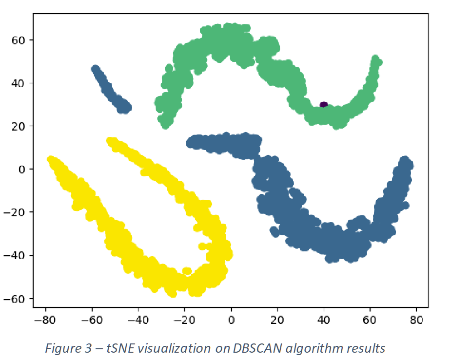
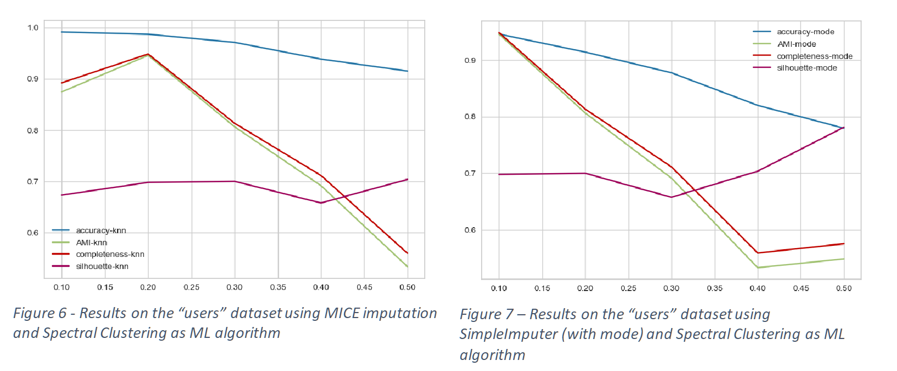

# Data and Information Quality clustering project

The assigned project consists in evaluating the impact of imputation methods on the clustering performance at varying level of missing values. To peform the assessment, we worked on the Abalone and Users datasets.
Here are some of the results we achieved:

